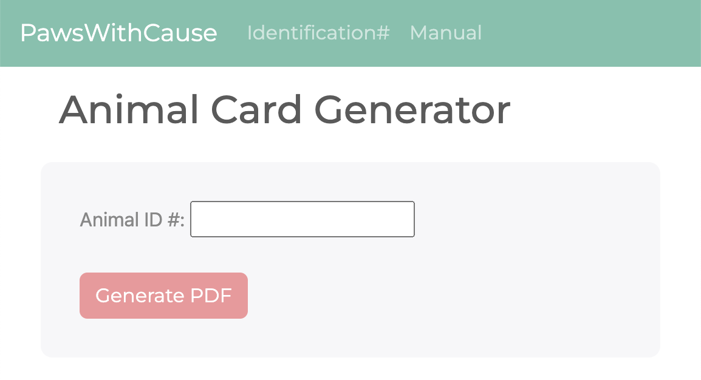
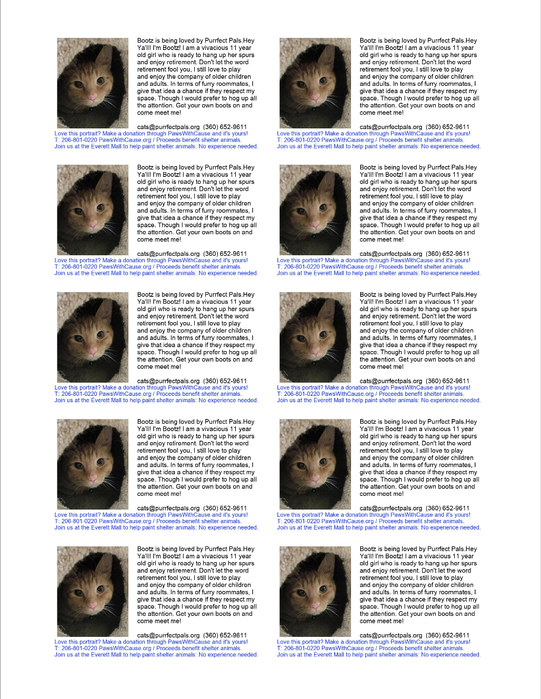

# Paws With Cause - Animal Card Generator

Web application to automate the creation of information cards for animals in shelters.

Use animal id # to automatically generate pdf by connecting to PWC backend. Or manually input the data for the animal.

## Impact

This automation turned a 16hr/week task into less than 1hr/week, enabling volunteers to spend more time focusing on finding homes for animals in need.

## Technologies Used

Python, Flask, Jinja2, PIL, Bootstrap, CSS.

Deployed to Heroku.

## Visuals

Frontend:

PDF generated:

